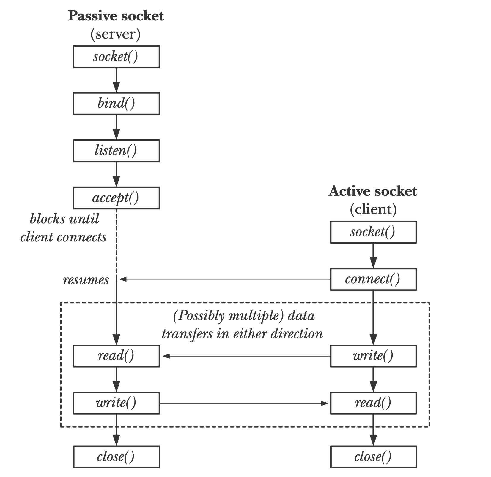

*This project has been created as part of the 42 curriculum by mavissar, scesar.*

# Webserv

## Description
**Webserv** is a custom-built HTTP/1.1 server written from scratch in C++98. The goal of this project is to dive deep into network programming, socket management, and the HTTP protocol by recreating the core functionalities of a web server like NGINX. 

This server is entirely non-blocking and relies on a single I/O multiplexing system (e.g., `poll()`, `select()`, or `epoll()`) to handle concurrent client connections securely and efficiently. It parses a configuration file, manages multiple virtual servers on different ports or hostnames, serves static files, and executes dynamic content via Common Gateway Interface (CGI).

### Key Features
* **I/O Multiplexing:** Capable of handling hundreds of simultaneous connections without hanging or crashing, using a single main loop.
* **HTTP Methods:** Full support for `GET`, `POST`, and `DELETE` requests.
* **Configuration Parsing:** Reads and validates an NGINX-style `.conf` file to configure routes, ports, hostnames, default pages, and error pages.
* **CGI Execution:** Dynamically executes scripts (e.g., Python, PHP) based on file extensions, passing the correct environment variables and handling timeouts.
* **Upload & File Management:** Capable of handling file uploads and physical deletions safely.
* **Resilience:** Strict memory leak management and robust error handling to prevent server crashes under heavy load or malformed requests.

---
### Introduction
## HTTP 

Hypertext Transfer Protocol is a protocol in the application layer of the OSI reference model and is used for data transfer between networks.

It usually has a flow where the Client machine makes a request to the Server machine and receives a response at the end of this request. When browsing websites, the person browsing the site is called the Client and the structure that provides the content of the site is called the Server.

HTTP consists of requests and responses. When a client (such as a web browser) wants to retrieve a webpage from a server, it sends an HTTP request to the server. The server then processes the request and sends back an HTTP response.

https://miro.medium.com/v2/resize:fit:720/format:webp/1*KeNok_6MOjeFdlgH3LJuVQ.png

HTTP Request Methods

    GET: A request method that requests only the resource itself, without requesting changes to anything on the server.
    POST: A method of request to create a new resource by sending data to the server.
    DELETE: It is a request method to delete a specific data on the server.

HTTP Requests

HTTP requests are made by a client to request an action on a resource identified by a URI (Uniform Resource Identifier). There are several types of HTTP requests, each designed for specific actions:

    GET: Requests data from a specified resource.
    POST: Submits data to be processed to a specified resource.
    PUT: Updates a specified resource with the data provided.
    DELETE: Deletes a specified resource.
    HEAD: Similar to GET, but it requests only the headers and status line, not the body of the response.
    PATCH: Applies partial modifications to a resource.
    OPTIONS: Returns the HTTP methods that the server supports for a specific URL.

HTTP Response Status Codes

HTTP response status codes are issued by a server in response to a client's request made to the server. These codes are divided into five categories:
1xx: Informational

    100 Continue: The server has received the request headers, and the client should proceed to send the request body.

2xx: Success

    200 OK: The request has succeeded. The information returned with the response depends on the method used in the request.
    201 Created: The request has been fulfilled, leading to the creation of a new resource.
    202 Accepted: The request has been accepted for processing, but the processing has not been completed.
    204 No Content: The server successfully processed the request but is not returning any content.

3xx: Redirection

    301 Moved Permanently: The URL of the requested resource has been changed permanently. The new URL is given in the response.
    302 Found: Indicates that the resource is temporarily under a different URI.
    304 Not Modified: Indicates that the resource has not been modified since the last request.

4xx: Client Error

    400 Bad Request: The server cannot or will not process the request due to an apparent client error (e.g., malformed request syntax).
    401 Unauthorized: Authentication is required and has failed or has not yet been provided.
    403 Forbidden: The server understood the request but refuses to authorize it.
    404 Not Found: The requested resource could not be found but may be available in the future.
    405 Method Not Allowed: A request method is not supported for the requested resource.

5xx: Server Error

    500 Internal Server Error: A generic error message, given when an unexpected condition was encountered and no more specific message is suitable.
    501 Not Implemented: The server either does not recognize the request method, or it lacks the ability to fulfill the request.
    503 Service Unavailable: The server is currently unavailable (because it is overloaded or down for maintenance).

## SERVER
Socket

HTTP communication usually takes place over TCP. A typical HTTP session often consists of three steps: The client and server establish a TCP connection stream, the client sends HTTP request over TCP connection, and then the server processes that request and sends back a reply. The second and third step can be repeated any number of times, until both client and server decide to close the underlying TCP connection. To put it in a simple diagram, this is how the process looks like in the perspective of TCP.

To create a server you need to follow this steps:

    Create a socket and listen for new connections.
    Accept incoming client connections.
    Receive messages, process them and sends some responses to the client. This is where HTTP message exchange happens.
    When one party wants to close the connection, it will do that by sending an EOF character and closing the socket file descriptor.

## CGI
CGI (Common Gateway Interface) is a way for web servers and server-side programs to interact. CGI is completely independent of programming language, operating system and web server. Currently it is the most common server-side programming technique and it's also supported by almost every web server in existence. Moreover, all servers implement it in (nearly) the same way, so that you can make a CGI script for one server and then distribute it to be run on any web server.

The server needs a way to know which URLs map to scripts and which URLs just map to ordinary HTML files. For my CGI i start by creating CGI directories on the server. This is done in the server setup and tells the server that all files in a cgi-bin directory are CGI scripts to be executed when requested. so one can tell that URLs like this: http://localhost/cgi-bin/anim.js point to a CGI script.
## Instructions

### Prerequisites
* A Unix-like operating system (Linux/macOS)
* `make`
* A C++ compiler (`c++`, `g++`)

### Compilation
Clone the repository and run `make` at the root directory to compile the executable.

```bash
git clone [your_repository_url]
cd webserv
make

Execution

The server requires a configuration file to run. If no file is provided, it may fall back to a default configuration (if implemented), but it is highly recommended to specify one.
Bash

# Run with a specific configuration file
./webserv conf/def.conf

Basic Testing

Once the server is running, you can test it using a browser or curl from another terminal:
Bash

# Simple GET request
curl -i http://localhost:8080/

# Test a specific route or error page
curl -i http://localhost:8080/non_existent_page

# Test file upload (POST)
curl -i -X POST --data-binary "@test.txt" http://localhost:8080/upload/test.txt

Resources
Documentation & References

        https://ncona.com/2019/04/building-a-simple-server-with-cpp/
        https://www.tutorialspoint.com/cplusplus/cpp_web_programming.htm
        https://www.tutorialspoint.com/python/python_cgi_programming.htm
        https://www.ibm.com/docs/en/i/7.2.0?topic=designs-example-nonblocking-io-select
        http://dwise1.net/pgm/sockets/blocking.html
        https://w3.cs.jmu.edu/kirkpams/OpenCSF/Books/csf/html/TCPSockets.html
        https://codefinity.com/blog/HTTP-Requests-and-Responses-Explained
        https://beej.us/guide/bgnet/html/#client-server-background